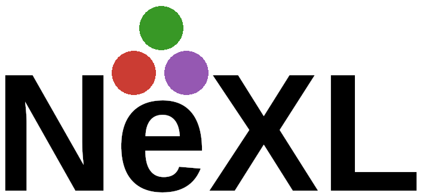

# NeXLCore.jl


## Core X-ray Microanalysis Data and Algorithms

#### Installation
```julia
using Pkg
# We need to first install three dependencies that aren't in the Julia registry (yet...)
Pkg.add(PackageSpec(url="https://github.com/usnistgov/BoteSalvatICX.jl"))
Pkg.add(PackageSpec(url="https://github.com/usnistgov/FFAST.jl"))
Pkg.add(PackageSpec(url="https://github.com/NicholasWMRitchie/NeXLUncertainties.jl"))
# Now install NeXLCore
Pkg.add(PackageSpec(url="https://github.com/NicholasWMRitchie/NeXLCore.jl"))
```

NeXLCore is part of the NeXL collection of Julia language packages.

#### Stablizing (Nearing release status - &beta;ish)
  - [NeXLUncertainties](https://github.com/NicholasWMRitchie/NeXLUncertainties.jl) - Basic data structures and algorithms for single uncertain values and collects of related uncertain values
  - [NeXLCore](https://github.com/NicholasWMRitchie/NeXLCore.jl) - Core data and algorithms for X-ray microanalysis (elements, shells, transitions and their properties)

#### Under rapid development but largely functional (pre-&alpha;)
  - [NeXLSpectrum](https://github.com/NicholasWMRitchie/NeXLSpectrum.jl) - Data structures and algorithms for EDS spectrum and hyperspectral data (reading/writing/fitting/etc.)
  - [NeXLMatrixCorrection](https://github.com/NicholasWMRitchie/NeXLMatrixCorrection.jl) - Data structures and algorithms for matrix correction of electron excited X-ray k-ratios
  - [NeXLDatabase](https://github.com/NicholasWMRitchie/NeXLDatabase.jl) - A database for handling NeXL library datatypes

#### Currently broken
  - [NeXLParticle](https://github.com/NicholasWMRitchie/NeXLParticle.jl) - Data structures and algorithms for dealing with particle data (particularly ASPEX Zeppelin datasets)

#### Depreciated
I'll be integrating these examples into the individual libraries
  - [NeXLNotebooks](https://github.com/NicholasWMRitchie/NeXLNotebooks) - Jupyter notebooks with examples of applying the NeXL packages

### Standards in NeXL

To reduce ambiguity, the following X-ray microanalysis-standard units are used by all packages even when there are more common or accessible units for a quantity.  Thus stage position is in cm (not mm), coating thicknesses are in cm (not nm), etc.  This means you never need to consult the documentation to know what units a function expects.

  - Mass is measured in grams (g)
  - Length is measured in centimeters (cm)
  - Time is measured in seconds (s)
  - Energy is measured in electron-volts (eV)
  - Pressure is measured in Pascal (p)
  - Mixed units are expressed in combinations of these units (MACS are in cm<sup>2</sup>/g)

NeXLCore implements a `@n_str` macro to parse Element, SubShell and Transition objects at compile time.  The `n"???"` notation is used throughout NeXL.
```julia
n"Fe" # constructs an Element representing iron
n"L3" # constructs a SubShell object representing an L3 shell (not element specific)
      # Note: The ambiguiuty between potassium K and shell K is handled by calling the shell n"K1"
n"Fe L3" # constructs an AtomicSubShell representing the iron L3 sub-shell.
n"L3-M5" # constructs a Transition representing the L3-M5 transition (not element specific)
n"Fe L3-M5" # Constructs a CharXRay representing the L3-M5 transition in iron.
```

To access the characteristic energies associated with these items, use the function `energy(...)` which returns eV.
```julia
energy(n"Fe K") # 7112.0
energy(n"Fe K-L3") # 6403.9
```

NeXL uses https://github.com/JuliaPhysics/PeriodicTable.jl for elemental data.

NeXL uses FileIO to implement file reading and writing.  Various different X-ray microanalysis related file types are recognise by a combination of file extension and file content and can be read using code like
```julia
using FileIO
using NeXLSpectrum
spec = load("~/home/data/spectrum.msa") # To read an EMSA spectrum
```

NeXL uses Gadfly (https://github.com/GiovineItalia/Gadfly.jl) to plot data items.  However, the Gadfly support is not loaded unless/until the user `using Gadfly` elsewhere in their code.  Thus Gadfly support is lightweight and doesn't hinder those who don't want to use it.  However, NeXL implements different specializations of the `Gadfly.plot(...)` method to handle NeXL-related data types.

```julia
using Gadfly
plot([ n"K-L3", n"L3-M5" ]) # plots the edge-energies associated with these shells over the range of supported elements
```
or (when `using NeXLSpectrum`)
```julia
using Gadfly
plot(spec,klms=[n"Fe",n"Si",n"O",n"Al"])#  To plot a spectrum with KLM lines.
plot([spec1,spec2,spec3],klms=[n"Fe",n"Si",n"O",n"Al"]) #  To plot a list of spectra with KLM lines.
```

NeXL uses `DataFrames` to tabulate data.  To convert an object or list of objects to a `DataFrame` use `asa(DataFrame,item)`.
